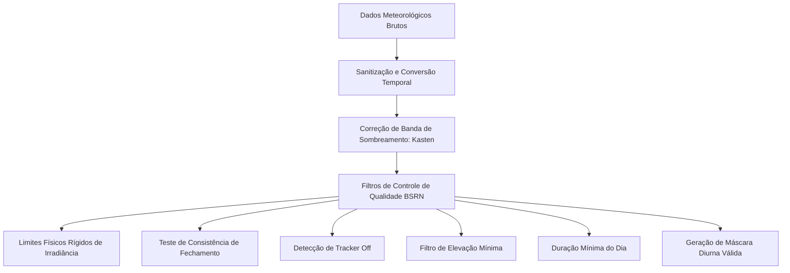

# Fundamentação e Metodologia Científica: Previsão Solar e Irradiância Atmosférica

Este documento apresenta a fundamentação física, matemática e meteorológica detalhada de toda a infraestrutura científica desenvolvida no repositório `Remodelacao_mestrado`. Diferente de uma abordagem puramente computacional, esta metodologia descreve o pipeline sob a ótica da **geofísica solar, da modelagem atmosférica e do aprendizado de máquina guiado por física (Physics-Informed Machine Learning)**. O objetivo é fornecer uma base teórica rigorosa que sirva de referência conceitual para o seu agente de redação científica.

---

## 1. Tratamento, Controle de Qualidade e Correções Físicas da Base de Dados

A precisão de qualquer modelo preditivo de irradiância solar depende criticamente da confiabilidade das observações em superfície. Instrumentos de medição solar (como piranômetros e pireliômetros) estão sujeitos a desvios térmicos, acúmulo de sujeira, desalinhamento de rastreadores e ruídos eletrônicos. Por isso, desenvolveu-se uma metodologia rigorosa baseada em princípios meteorológicos clássicos e nas diretrizes internacionais da rede **BSRN (*Baseline Surface Radiation Network*)**.



### 1.1 Controle de Qualidade Física (Padrão BSRN)
Para assegurar a consistência física dos dados, cada registro passa por uma série de testes geofísicos simultâneos no módulo `QualityControlFilter`. O resultado é uma máscara binária contínua ($Mask = 1.0$ se aprovado, $0.0$ se rejeitado). Os filtros aplicados dividem-se em três níveis de consistência:

#### A. Limites Físicos Rígidos (Limites BSRN)
Garantem que os valores medidos de irradiância global horizontal ($GHI$), difusa horizontal ($DHI$) e direta normal ($DNI$) não excedam os limites físicos astronômicos plausíveis de incidência no topo da atmosfera (radiação extraterrestre, $I_{sc}$).
*   **Irradiância Global Horizontal ($GHI$)**:
    $$0 < GHI < 100 + 1.2 \cdot I_{sc} \cdot \cos(\theta_z)^{1.2}$$
*   **Irradiância Difusa Horizontal ($DHI$)**:
    $$0 < DHI < 50 + 0.95 \cdot I_{sc} \cdot \cos(\theta_z)^{1.2}$$
*   **Irradiância Direta Normal ($DNI$)**:
    $$0 \le DNI < I_{sc}$$
Onde $I_{sc} = G_{on}$ representa a radiação extraterrestre na data correspondente e $\theta_z$ é o ângulo zenital solar. O expoente $1.2$ ajusta a atenuação da atmosfera com base na massa de ar ótica.

#### B. Teste de Consistência e Fechamento (Closure Test)
Como a radiação solar que atinge um plano horizontal é a soma vetorial da componente direta (projetada na horizontal) e da componente difusa dispersa pela atmosfera, estabelece-se a relação fundamental:
$$GHI_{calc} = DHI + DNI \cdot \cos(\theta_z)$$
O teste de fechamento exige que a diferença relativa entre o $GHI$ medido diretamente pelo piranômetro horizontal e a componente reconstruída $GHI_{calc}$ não exceda tolerâncias estritas baseadas na altura do sol na abóbada celeste:
$$\text{Erro Relativo} = \frac{|GHI - GHI_{calc}|}{GHI}$$
O registro é validado se, e somente se:
$$\text{Erro Relativo} < \begin{cases} 
0.08, & \text{para elevações solares } \alpha > 15^\circ \text{ e } GHI_{calc} > 50\text{ W/m}^2 \\
0.15, & \text{para elevações solares } \alpha \le 15^\circ \text{ e } GHI_{calc} > 50\text{ W/m}^2 
\end{cases}$$
Onde $\alpha = 90^\circ - \theta_z$ é o ângulo de elevação solar.

#### C. Filtros de Exclusão Operacional e Meteorológica
*   **Filtro de Elevação Mínima**: Exclui-se qualquer registro onde a elevação solar seja inferior a $10^\circ$ ($\alpha \le 10^\circ$). Esse critério é vital para remover o ruído de refração do horizonte e o efeito cosseno em piranômetros, onde pequenas imprecisões no ângulo geram grandes divisões espúrias.
*   **Detecção de Rastreador Inoperante (*Tracker Off*)**: Identifica anomalias em que o seguidor automático de sol falha mecânica ou eletrônica. Sob céu claro ($GHI/GHI_{cs} > 0.85$), se a fração de difusa medida for excessivamente alta ($DHI/GHI > 0.85$), o dado é marcado como espúrio, pois em condições límpidas a radiação direta deve predominar.
*   **Filtro de Duração Mínima do Dia**: Para evitar a inclusão de amostras isoladas ruidosas, anula-se a máscara do dia inteiro se o somatório diário acumulado de registros aprovados pelos filtros BSRN for menor que 5 horas.

### 1.2 Correção de Banda de Sombreamento para Radiação Difusa (KA)
Medições de irradiância difusa ($DHI$) realizadas através de anéis de sombreamento (shading bands) sofrem de uma atenuação sistemática. O anel bloqueia o disco solar direto, mas obstrui também uma porção significativa da abóbada celeste difusa. Para corrigir essa perda física, o sistema implementa a formulação clássica de **Kasten (KA)** no módulo `KastenCorrector`:
$$f = A + B \left(\frac{k_{du}}{k_t}\right)^3 + C \cdot \alpha + \frac{D}{\ln(1/\tau_{bu})}$$
Onde:
*   Os parâmetros empíricos calibrados do anel de sombreamento são: $A = 1.161$, $B = -0.112$, $C = 0.0009$ e $D = -0.0246$.
*   $k_{du} = DHI_{measured} / G_{0h}$ é o índice de claridade difuso.
*   $k_t = GHI_{measured} / G_{0h}$ é o índice de céu claro global.
*   $\tau_{bu} = k_t - k_{du}$ representa a transmitância atmosférica direta do feixe. A fim de garantir a estabilidade termodinâmica e evitar a indeterminação matemática ou a explosão logarítmica da divisão por zero ($\ln(1/1) = 0$), $\tau_{bu}$ é projetado no intervalo restrito $[0.0001, 0.9999]$.
A irradiância difusa final corrigida é dada por:
$$DHI_{corrected} = DHI_{measured} \cdot f$$

---

## 2. Modelos de Céu Claro e Calibração Dinâmica do Linke Turbidity

Os modelos de céu claro estimam a irradiância solar máxima possível sob condições atmosféricas ideais e totalmente desprovidas de nebulosidade. Eles atuam como a referência (baseline físico superior) que permite isolar a atenuação provocada pelas nuvens.

### 2.1 Formulação Física do Modelo ESRA
Implementado no módulo `cs_model/esra.py`, o modelo **ESRA (*European Solar Radiation Atlas*)** descreve analiticamente a transmitância da radiação solar através de processos de atenuação física.

1.  **Espessura Óptica de Rayleigh Pura ($R_s$)**:
    Representa a atenuação molecular causada pelo espalhamento de Rayleigh da luz em função da massa de ar ótica ($m$):
    $$R_s(m) = \begin{cases}
    \frac{1}{6.6296 + 1.7513m - 0.1202m^2 + 0.0065m^3 - 0.00013m^4}, & \text{se } m \le 20 \\
    \frac{1}{10.4 + 0.718m}, & \text{se } m > 20
    \end{cases}$$
2.  **Transmitância Direta da Atmosfera ($Tr_b$)**:
    Incorpora o **Fator de Turbidez de Linke ($TL$)**, que parametriza de forma agregada a absorção por vapor de água e o espalhamento por aerossóis secos, escalonados pela razão de pressão barométrica local ($p/p_0$):
    $$Tr_b = \exp\left( -0.8662 \cdot TL \cdot \left(\frac{p}{p_0}\right) \cdot R_s(m) \right)$$
    Onde $p/p_0 = \exp(-z / 8434.5)$ é a correção barométrica baseada na altitude local ($z$, em metros).
3.  **Irradiâncias de Céu Claro Calculadas**:
    A irradiância direta normal sob céu claro ($G_{c, DNI}$) e a irradiância difusa horizontal ($G_{c, DHI}$) são formuladas a partir de coeficientes angulares polinomiais ($F_b$ e $Fd$, tabelados conforme faixas angulares da elevação solar $\alpha$):
    $$G_{c, DNI} = G_{on} \cdot Tr_b \cdot F_b(\alpha, TL)$$
    $$G_{c, DHI} = G_{on} \cdot Tr_d(TL) \cdot F_d(\alpha, TL)$$
    $$G_{c, GHI} = G_{c, DNI} \cdot \sin(\alpha) + G_{c, DHI}$$

### 2.2 Algoritmo de Calibração Dinâmica e Inversa de Aerossóis ($TL$)
O fator de turbidez de Linke ($TL$) varia sazonalmente conforme os níveis de poluição, umidade do ar e ventos locais. Em vez de utilizar um coeficiente estático ($TL = 3.0$), implementou-se um método dinâmico inverso para recalibrar o modelo de céu claro às condições geofísicas reais da planta de teste.

```
[Dados Medidos de GHI] 
       |
       v
[Filtro Pearson-Magnitude] ---> Descarta dias nublados / Transientes
       |
       v  (Somente dias com r >= 0.95 e razão de energia >= 0.8)
[Otimização Numérica por Minimização RMS (scipy)] ---> Calibra TL ótimo para dias claros
       |
       v
[Interpolação Linear Temporal] ---> Preenche dias nublados faltantes continuamente
       |
       v
[Geração das Curvas de GHI cs, DHI cs e DNI cs Dinâmicas]
```

1.  **Detecção de Dias Límpidos (Filtro Pearson-Magnitude)**:
    Filtra o DataFrame para identificar dias que apresentem formato senoidal limpo e níveis altos de irradiância:
    *   *Correlação de Pearson*: Correlação linear entre o perfil medido e um perfil teórico neutro do dia deve ser $r \ge 0.95$.
    *   *Razão de Magnitude*: A razão de energia diária integrada deve ser $\ge 0.8$.
2.  **Otimização Numérica Local**:
    Para cada dia classificado como céu claro, resolve-se o problema inverso de minimização do desvio quadrático médio ($RMSE$) entre a curva teórica $G_{c, GHI}$ e as medições reais de irradiância global horizontal ($GHI_{med}$):
    $$\min_{TL \in [1, 10]} \sqrt{\frac{1}{M} \sum_{i=1}^M \left( GHI_{med, i} - G_{c, GHI, i}(TL) \right)^2}$$
    Onde $M$ é o número de medições válidas diurnas daquele dia. A resolução é dada numericamente via método escalar delimitado.
3.  **Interpolação Temporal Contínua**:
    Nos dias nublados, onde a otimização não é viável, o sistema estima o $TL$ por **interpolação linear** entre os valores ótimos obtidos nos dias claros vizinhos. Isso garante a geração de curvas de céu claro dinâmicas que evoluem com o clima local ao longo das estações do ano.

### 2.3 Modelo de Partição de Fração Difusa BRL
O modelo **BRL (*Boland-Ridley-Lauret*)** estima a fração difusa ($k_d$) utilizando regressão logística a partir de índices astronômicos e meteorológicos locais:
$$k_d = \frac{1}{1 + \exp(Z)}$$
Onde a função logística $Z$ é formulada como:
$$Z = \beta_0 + \beta_1 \cdot k_t + \beta_2 \cdot AST + \beta_3 \cdot \alpha + \beta_4 \cdot KT_{diario} + \beta_5 \cdot \psi$$
*   **AST (*Apparent Solar Time*)**: Tempo solar aparente do local, que corrige as irregularidades da órbita terrestre via Equação do Tempo ($EoT$) e longitude ($\lambda$):
    $$AST = UTC + \frac{\lambda}{15} + \frac{EoT(doy)}{60} \pmod{24}$$
*   **$KT_{diario}$**: Índice de céu claro diário ponderado pela radiação extraterrestre, que indica o nível geral de nebulosidade acumulada no dia.
*   **$\psi$**: Coeficiente de persistência atmosférica baseado nos índices dos passos anterior ($t-1$) e posterior ($t+1$).

---

## 3. Modelos de Previsão e Arquiteturas Neurais Recursivas Matemáticas

O repositório disponibiliza dois caminhos metodológicos principais para a previsão:
1.  **Previsão do Índice de Céu Claro (Modo *Sky*)**: Prediz o vetor $[k_t, k_d]$ (Índice de Céu Claro e Fração Difusa). Trata-se de uma abordagem puramente física e independente da tecnologia do painel solar. A potência PV final é obtida em pós-processamento.
2.  **Previsão Direta de Potência Solar (Modo *Power*)**: Prediz a potência PV útil normalizada ($P_{pv}/P_{nominal}$), incorporando dinamicamente o coeficiente de degradação física anualizada dos painéis fotovoltaicos (taxa de perda contínua de $5.0\%$ ao ano a partir de 2018):
    $$\text{Potência Normalizada} = \frac{P_{pv}}{P_{nominal} \cdot \left[1 - 0.05 \cdot (Year - 2018)\right]}$$

### 3.1 Formulação Matemática da Rede Encoder-Decoder com Dupla Atenção

O modelo Sequence-to-Sequence (Encoder-Decoder) é estruturado como um sistema dinâmico autoregressivo composto por três blocos matemáticos fundamentais:

```
Descrição do Fluxo da Rede:
Entrada Temporal X (Lags) ---> [ FEATURE ATTENTION LAYER ]
                                         |
                                         v  (Entrada Filtrada X')
                               [ LSTM/GRU ENCODER ] 
                                         |
                                         v  (Outputs do Encoder H_enc)
                              [ TEMPORAL ATTENTION ] <--- [ Estado Oculto do Decoder h_d,t-1 ]
                                         |
                                         v  (Vetor de Contexto c_t)
                               [ LSTM/GRU DECODER ]
                                         |
                                         v
                            [ CAMADA DENSE + SIGMOIDE ] ---> Previsão Bounded Y
```

#### A. Feature Attention Layer (Filtro Dinâmico de Relevância de Variáveis)
Dada uma sequência de entrada $X = [x_1, x_2, \dots, x_T]$ onde cada vetor possui dimensão $D$ (número de características), a camada calcula uma pontuação dinâmica de relevância para cada variável no instante $t$:
$$s_t = \mathbf{W}_2 \cdot \tanh(\mathbf{W}_1 \cdot x_t + b_1) + b_2$$
A pontuação é normalizada utilizando a função softmax ao longo da dimensão das variáveis, gerando um vetor de pesos $\beta_t \in \mathbb{R}^D$ tal que a soma de suas componentes é exatamente $1.0$:
$$\beta_{t, i} = \frac{\exp(s_{t, i})}{\sum_{j=1}^D \exp(s_{t, j})}$$
O vetor de entrada filtrado e ponderado $x'_t$ é obtido via multiplicação ponto a ponto (*element-wise*):
$$x'_t = x_t \odot \beta_t$$
Isso permite que a rede neural atenue características irrelevantes ou ruidosas a cada instante, priorizando variáveis críticas conforme a transição climatológica do dia.

#### B. Encoder Recorrente Bidirecional e Fusão de Direções
O vetor $x'_t$ alimenta uma rede recorrente empilhada (LSTM ou GRU). O uso de recorrência bidirecional gera sequências de estados ocultos em ambas as direções temporal:
$$\vec{h}_t = \text{LSTM}_{fwd}(x'_t, \vec{h}_{t-1})$$
$$\overleftarrow{h}_t = \text{LSTM}_{bwd}(x'_t, \overleftarrow{h}_{t+1})$$
O output do encoder é a concatenação das direções: $h_{enc, t} = [\vec{h}_t \,;\, \overleftarrow{h}_t]$. 
Para inicializar o decoder de forma consistente sem duplicar os parâmetros internos da rede, os estados ocultos ($h$) e de célula ($c$) finais do codificador passam por uma **fusão matemática de soma**:
$$h_{init} = \vec{h}_T + \overleftarrow{h}_1$$
$$c_{init} = \vec{c}_T + \overleftarrow{c}_1$$

#### C. Temporal Attention Decoder (Alinhamento Temporal de Bahdanau)
Durante a fase de decodificação de um passo futuro $t'$, calcula-se a correlação temporal entre o estado oculto anterior do decodificador $h_{dec, t'-1}$ e todos os estados gerados pelo codificador no histórico passado $h_{enc, t}$:
$$e_{t', t} = v_a^T \cdot \tanh(\mathbf{W}_a \cdot h_{dec, t'-1} + \mathbf{U}_a \cdot h_{enc, t})$$
A normalização gera o vetor de atenção temporal $\alpha_{t'} \in \mathbb{R}^T$:
$$\alpha_{t', t} = \frac{\exp(e_{t', t})}{\sum_{k=1}^T \exp(e_{t', k})}$$
O vetor de contexto $c_{t'}$ representa a média ponderada temporal da memória do codificador:
$$c_{t'} = \sum_{t=1}^T \alpha_{t', t} \cdot h_{enc, t}$$
O vetor de entrada do decodificador combina a previsão anterior com o contexto geofísico gerado pela atenção:
$$x_{dec, t'} = [y_{pred, t'-1} \,;\, c_{t'}]$$
A previsão final passa por uma ativação **Sigmoide** ($\sigma$), garantindo matematicamente que as saídas do modelo respeitem os limites assintóticos reais $[0, 1]$ das frações de irradiância e potência solar normalizada:
$$y_{pred, t'} = \sigma(\mathbf{W}_o \cdot h_{dec, t'} + b_o)$$

---

## 4. Experimentação de Funções de Custo Avançadas baseadas em Física e Estatística

Para superar as limitações do erro médio quadrático ($MSE$) tradicional (que induz o modelo a gerar curvas excessivamente suavizadas e a violar limites geofísicos), foram desenvolvidas e experimentadas três novas abordagens matemáticas de funções de custo.

### 4.1 Redes Neurais Guiadas por Física (PINN - Physics-Guided Loss)
A abordagem **PINN** formulada em `core/loss_function/pyloss.py` insere penalidades físicas baseadas em desigualdades termodinâmicas no cálculo da perda. O modelo prediz $[k_t, k_d]$ e reconstrói as componentes equivalentes no plano:
$$GHI_{pred} = k_{t, pred} \cdot G_{0h}$$
$$DHI_{pred} = k_{d, pred} \cdot GHI_{pred}$$
$$DNI_{pred} = \frac{GHI_{pred} - DHI_{pred}}{\cos(\theta_z)}$$

As penalidades são calculadas através de operadores retificadores lineares (**ReLU** - *Rectified Linear Unit*), que aplicam gradiente nulo se a condição física for atendida, e punição linear estrita em caso de violação:

#### Penalidades Físicas Rígidas ($Loss_{hard}$)
1.  **Violação dos Limites Superiores BSRN ($Limit = 100 + 1.5 \cdot I_{sc} \cdot \cos(\theta_z)^{1.2}$)**:
    $$L_{ghi} = \text{ReLU}(GHI_{pred} - Limit) + \text{ReLU}(0 - GHI_{pred})$$
    $$L_{dhi} = \text{ReLU}(DHI_{pred} - Limit) + \text{ReLU}(0 - DHI_{pred})$$
2.  **Excesso de Radiação Direta (DNI)**:
    $$L_{dni} = \text{ReLU}(DNI_{pred} - I_{sc}) + \text{ReLU}(0 - DNI_{pred})$$
3.  **Inconsistência de Fechamento Geométrico**:
    Mede o desvio de fechamento das componentes de irradiância em relação ao desvio máximo fisicamente tolerável ($Lim_{val}$ igual a $8\%$ ou $15\%$):
    $$L_{closure} = \text{ReLU}\left( \frac{|GHI_{pred} - (DHI_{pred} + DNI_{pred} \cdot \sin(\alpha))|}{GHI_{pred}} - Lim_{val} \right)$$
    $$L_{components} = \text{ReLU}\left( 50 - (DHI_{pred} + DNI_{pred} \cdot \sin(\alpha)) \right)$$

#### Penalidades Físicas Suaves ($Loss_{soft}$)
1.  **Filtro Meteorológico de Condições de Céu Totalmente Encoberto (Overcast)**:
    $$L_{min\_slope} = \text{ReLU}\left( \frac{\alpha - 10}{10000} - \frac{GHI_{pred}}{I_{sc} \cdot \sin(\alpha)} \right)$$
2.  **Consistência da Fração Difusa Máxima**:
    $$L_{diffuse} = \text{ReLU}\left( \frac{DNI_{pred} \cdot \sin(\alpha)}{GHI_{pred}} - \left(\frac{GHI_{pred}}{G_{c, GHI}} + 0.1053\right) \right)$$

A perda final incorpora estes pesos de restrição através de coeficientes de Lagrange fixos ($\lambda_{hard}$ e $\lambda_{soft}$):
$$Loss_{total} = Loss_{data} + \lambda_{hard} \cdot \text{masked\_mean}(L_{hard}) + \lambda_{soft} \cdot \text{masked\_mean}(L_{soft})$$

### 4.2 Regularização por Persistência Meteorológica
Para evitar que o modelo sofra do viés clássico de atraso temporal (onde a rede neural apenas aprende a repetir o último valor medido $y_t$ para prever $y_{t+1}$), implementou-se a **Perda Regularizada por Persistência** (`PhysicsGuidedLossPers`):
1.  **Cálculo dos Erros Relativos**:
    O erro quadrático do modelo predito ($\hat{y}_{pred}$) e o erro que a persistência climatológica pura teria obtido baseando-se no último ponto real do passado ($x_{past, last}$) são computados:
    $$E_{model} = (y_{target} - \hat{y}_{pred})^2$$
    $$E_{pers} = (y_{target} - x_{past, last})^2$$
2.  **Regularização Dinâmica**:
    A rede sofre uma penalidade adicional se o seu erro exceder o erro da persistência, incentivando-a a detectar flutuações rápidas e dinâmicas atmosféricas:
    $$Loss_{pers} = \text{masked\_mean}\left( \text{ReLU}(E_{model, kt} - E_{pers, kt}) + \text{ReLU}(E_{model, kd} - E_{pers, kd}) \right)$$
    $$Loss_{total} = Loss_{PINN} + \lambda_{pers} \cdot Loss_{pers}$$

### 4.3 Função de Custo Distribucional CPI Loss
Implementada em `core/loss_function/cpiloss.py`, o **CPI (*Combined Performance Index*)** pondera de forma equilibrada o erro pontual clássico e a fidelidade da distribuição de probabilidades gerada pelo modelo:
$$Loss_{CPI} = \frac{KSI + OVER + 2 \cdot NRMSE}{4}$$

*   **NRMSE (Normalized Root Mean Squared Error)**: Mede o desvio absoluto quadrático médio, normalizado pela média das observações:
    $$NRMSE = \frac{\sqrt{\frac{1}{N} \sum_{i=1}^N (y_i - \hat{y}_i)^2}}{\bar{y} + \epsilon}$$
*   **KSI (*Kolmogorov-Smirnov Test Integral*)**:
    Para calibrar a semelhança entre as Funções de Distribuição Acumulada ($CDF$) real e prevista de forma diferenciável em PyTorch, os tensores de predição e alvo são ordenados espacialmente. A integral da diferença absoluta entre as curvas de distribuição contínuas é computada pela média das diferenças dos vetores ordenados:
    $$KSI = \frac{100}{1.63 \sqrt{N} \cdot VC} \sum_{i=1}^N |y_{sorted, i} - \hat{y}_{sorted, i}|$$
    Onde $VC$ é o coeficiente de variabilidade que normaliza a escala do sinal:
    $$VC = \max(y, \hat{y}) - \min(y, \hat{y}) + \epsilon$$
*   **OVER (*Over-limit Integral*)**:
    Penaliza desvios drásticos na distribuição empírica onde a distância entre as CDFs ultrapassa o limiar de significância estatística do teste clássico de Kolmogorov-Smirnov ($1.63\sqrt{N}$):
    $$Excess_i = \max\left(0, |y_{sorted, i} - \hat{y}_{sorted, i}| - \frac{1.63 \sqrt{N} \cdot VC}{N}\right)$$
    $$OVER = \frac{100}{1.63 \sqrt{N} \cdot VC} \sum_{i=1}^N Excess_i$$

---

## 5. Metodologia de Avaliação e Análise de Resultados Científicos

A avaliação de modelos de previsão de irradiância solar deve ir além das métricas estatísticas agregadas usuais, incorporando ferramentas visuais e análises microclimáticas que permitam atestar a utilidade prática do modelo para operadores de redes elétricas e geradores.

### 5.1 O Skill Score Meteorológico ($SS$)
O indicador chave para provar o valor científico do modelo é o **Skill Score ($SS$, %)** calculado em relação à referência de persistência meteorológica clássica. Ele mapeia a melhoria percentual obtida pelo modelo neural em termos de diminuição do desvio quadrático ($RMSE$):
$$SS = \left( 1 - \frac{RMSE_{modelo}}{RMSE_{persistencia}} \right) \cdot 100$$
*   Um $SS > 0$ indica que o modelo deep learning efetivamente aprendeu a dinâmica transiente da atmosfera e supera o baseline simples.
*   Um $SS \le 0$ mostra que o modelo não possui valor prático superior à persistência trivial.

### 5.2 O Diagrama de Taylor como Ferramenta Multidimensional
Implementado em `evaluation/metrics/statistical_metrics.py` através da biblioteca `skill_metrics`, o **Diagrama de Taylor** fornece um sumário estatístico visual altamente condensado e rigoroso da qualidade das séries temporais preditas comparadas com as medições observadas. Ele integra três parâmetros matemáticos interdependentes em uma única representação gráfica no plano:

```
Esquema do Diagrama de Taylor:
                          [ CORRELAÇÃO DE PEARSON (r) ]
                                / (Escala Angular)
                               /
    [ DESVIO PADRÃO (sigma) ]  / . . . . * [Modelo Predito]
           (Escala Radial)    /        .
                             /       .  (Distância = cRMSD)
                            /      .
                           /_____*______________________
                             [ REFERÊNCIA / OBSERVADO ]
```

1.  **Coeficiente de Correlação de Pearson ($r$)**:
    Mapeia a similaridade de fase e tempo entre as séries temporais. É exibido na escala angular do quadrante do círculo.
2.  **Desvio Padrão Normalizado ($\sigma$)**:
    Mapeia a capacidade do modelo de reproduzir a amplitude real de variabilidade (evitando previsões amortecidas). É exibido na escala radial a partir da origem do plano.
3.  **Erro Médio Quadrático Centrado ($cRMSD$)**:
    Mede a diferença livre de viés médio entre as previsões e as observações:
    $$cRMSD = \sqrt{\frac{1}{N} \sum_{i=1}^N \left[ (y_i - \bar{y}) - (\hat{y}_i - \bar{\hat{y}}) \right]^2}$$
    Graficamente, é representado pela distância euclidiana direta entre o ponto que localiza o modelo no diagrama e o ponto que define a referência experimental observada ($r = 1.0$, desvio padrão igual ao real, $cRMSD = 0$).

### 5.3 Validação por Análise de Cenários Microclimáticos
A avaliação inclui a partição automática e plotagem contínua dos dados em dois cenários climatológicos típicos identificados na base de dados histórica:
*   **Cenário de Céu Claro (Clear Sky)**: Dias caracterizados por altos níveis de irradiância integrada e baixíssima flutuação temporal (desvio padrão diurno reduzido). Avalia a capacidade do modelo de atingir o limite ideal de geração sem subestimar os picos de energia.
*   **Cenário Nublado/Transiente (Transient Cloudy)**: Dias de alta instabilidade atmosférica marcados por rápidas passagens de nuvens cúmulos (alta volatilidade e desvio padrão elevado). Avalia a capacidade do modelo recorrente de responder rapidamente a rampas repentinas de atenuação de potência, o que é o principal desafio técnico de integração de energia fotovoltaica nas redes elétricas brasileiras.

---

## 6. Inteligência Artificial Explicável (XAI) de base Física e Atmosférica

Para evitar o comportamento opaco de "caixa-preta" e certificar que a rede neural aprendeu dinâmicas coerentes com as leis da geofísica (em vez de correlações estatísticas espúrias), a engine implementada no arquivo `core/utils/xai.py` extrai mapas de relevância e foco da rede:

### 6.1 Integrated Gradients (IG) e Decaimento Temporal
Através da técnica de **Integrated Gradients (IG)** aplicada na biblioteca Captum, calcula-se a contribuição cumulativa de cada característica de entrada ao longo da dimensão de tempo do histórico passado ($n_{past}$).
*   **Aplicações Geofísicas**: O sistema gera gráficos de **Decaimento Temporal da Relevância**. Isso permite visualizar de forma científica se a importância das variáveis físicas diminui exponencialmente à medida que nos afastamos do instante de previsão (comportamento de dissipação típico de processos dinâmicos atmosféricos), ou se apresenta correlações periódicas com lags de 24 horas (ciclo diurno de rotação terrestre).

### 6.2 Extração de Atenção Física por Forward Hooks
Através de pontos de interceptação (*forward hooks*) registrados dinamicamente nas camadas de processamento da GPU durante a inferência, extraem-se dois tipos de pesos de relevância:
1.  **Matriz de Atenção Temporal ($\alpha_{t', t}$)**:
    Mapeia a relação direta entre cada instante da janela histórica passada (eixo Y) e o horizonte de previsão futuro (eixo X). Permite avaliar visualmente se a rede neural foca sua atenção no comportamento de tendência das horas que antecedem o nascer do sol ao realizar previsões matutinas, validando a coerência do modelo sequence-to-sequence.
2.  **Matriz de Atenção sobre Características ($\beta_{t, i}$)**:
    Intercepta as distribuições softmax da camada de feature attention. Plota um mapa bidimensional contínuo de **Importância de Feature vs Tempo de Lag**, revelando quais variáveis físicas de entrada (como índice $QS$, $VS_{cdfn}$, ou elevação solar) ganharam relevância dinâmica em tempo real durante a passagem de uma frente de nebulosidade.
