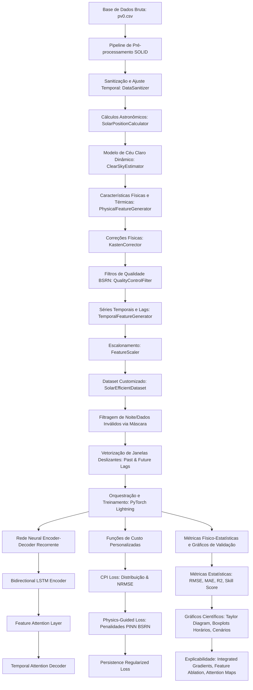

# Relatório de Metodologia Científica: Previsão Solar e Irradiância
Este documento reúne a documentação técnica rigorosa e a descrição metodológica de toda a infraestrutura de modelagem desenvolvida no repositório `Remodelacao_mestrado` durante o período de estágio sanduíche. A estrutura abaixo foi concebida para servir como referência conceitual e técnica de alta fidelidade para o agente autônomo de redação científica.

---

## 1. Visão Geral da Arquitetura e Engenharia do Sistema

O sistema foi desenvolvido sob princípios de modularidade, separação de preocupações e reprodutibilidade científica. A infraestrutura de modelagem divide-se em componentes reutilizáveis baseados no **PyTorch** e no **PyTorch Lightning** para a modelagem neural profunda, e no **Scikit-Learn** para o pipeline de processamento de características geofísicas e meteorológicas.

### 1.1 Estrutura de Fluxo de Dados e Controle
O pipeline completo segue o fluxo de execução descrito no diagrama a seguir:



### 1.2 Infraestrutura de Execução e Containerização
*   **Ambiente Docker**: O projeto está containerizado utilizando como base a imagem otimizada da NVIDIA **NGC (`nvcr.io/nvidia/pytorch:25.10-py3`)**, que garante compatibilidade de fábrica com aceleração CUDA, drivers cuDNN estáveis e compiladores de tensores otimizados para arquiteturas Tensor Core.
*   **Gerenciamento de Experimentos (MLflow)**: Todas as execuções de treinamento são rastreadas via **MLflow**, utilizando um banco de dados local `mlflow.db` (SQLite). São armazenados parâmetros de configuração (arquivos `.yaml` convertidos), hiperparâmetros de rede, curvas de aprendizado em tempo real e artefatos de saída (como o estado ótimo da rede `best_model.pt` e o escalonador `scaler_X.pkl`).
*   **Rastreamento de Carbono (CodeCarbon)**: Integração com a biblioteca `codecarbon` para quantificar o consumo energético de CPU/GPU e estimar o impacto ambiental das sessões de treino em termos de emissões de CO2 equivalentes ($CO_2e$), assegurando os princípios de Green AI.

---

## 2. Pipeline de Pré-Processamento Físico e Estatístico (Arquitetura SOLID)

Uma das principais contribuições da remodelação do código foi a transição de scripts monolíticos de pré-processamento para uma arquitetura orientada ao padrão **Aberto-Fechado (Open-Closed)** e **Responsabilidade Única (Single Responsibility)** do **SOLID**. Cada etapa de transformação é encapsulada em classes que herdam de `BaseEstimator` e `TransformerMixin` do `scikit-learn`, permitindo a montagem de um pipeline robusto (`sklearn.pipeline.Pipeline`).

### 2.1 Sanitização e Fuso Horário (`DataSanitizer`)
*   **Objetivo**: Renomeação estruturada de variáveis com base em um dicionário de mapeamento dinâmico (`column_mapping`), garantindo que alterações nos arquivos CSV de entrada não quebrem o núcleo do modelo.
*   **Ajuste Temporal**: Conversão e padronização do índice temporal para o fuso horário local onde os dados foram coletados (ex: `Etc/GMT+3` correspondente ao horário de Brasília sem horário de verão). Duplicatas de índice são eliminadas mantendo a primeira ocorrência, e os dados são ordenados cronologicamente a partir de um ano de corte (ex: $\ge 2018$ ou $\ge 2015$) para evitar dados de degradação inicial ruidosos.

### 2.2 Cinemática Solar (`SolarPositionCalculator`)
Utilizando a biblioteca geofísica `pvlib`, calcula-se a posição solar astronômica exata a cada instante de tempo com base na latitude ($\phi$), longitude ($\lambda$), altitude ($z$) e fuso horário.
*   **Zenite Solar ($\theta_z$) e Elevação ($\alpha$)**: Onde $\alpha = 90^\circ - \theta_z$.
*   **Azimute Solar ($\gamma_s$)**.
*   **Radiação Extraterrestre Horizontal ($G_{0h}$)**: 
    $$G_{0h} = G_{on} \cdot \cos(\theta_z)$$
    Onde $G_{on}$ é a radiação extraterrestre normal corrigida pela excentricidade orbital da Terra na data correspondente.
*   **Massa de Ar Absoluta ($m_{abs}$)**:
    $$m = \frac{p(z)}{p_0 \cdot \sin(\alpha + 6.07995 \cdot (\alpha + 5.0572)^{-1.6364})}$$
    Onde $p(z)/p_0 = \exp(-z / 8434.5)$ é a razão de pressões baseada na altitude barométrica.

### 2.3 Estimativa e Calibração Dinâmica de Céu Claro (`ClearSkyEstimator`)
O módulo permite a estimativa teórica da irradiância solar em condições ideais sem nuvens utilizando dois modelos: **Ineichen/Perez** ou o **ESRA (European Solar Radiation Atlas)**. A inovação metodológica consiste na **Calibração Dinâmica do Linke Turbidity (Factor de Turbidez de Linke, $TL$)**, que ajusta o modelo às condições de aerossóis locais do site.

#### 2.3.1 O Modelo Matemático ESRA
Implementado em `cs_model/esra.py`, o modelo calcula a irradiância direta normal sob céu claro ($G_{c, DNI}$), difusa horizontal ($G_{c, DHI}$) e global horizontal ($G_{c, GHI}$) através das seguintes formulações físicas:

1.  **Transmitância Direta da Atmosfera ($Tr_b$)**:
    $$Tr_b = \exp\left( -0.8662 \cdot TL \cdot \left(\frac{p}{p_0}\right) \cdot R_s(m) \right)$$
    Onde $R_s(m)$ representa a espessura óptica de espalhamento de Rayleigh pura da atmosfera:
    $$R_s(m) = \begin{cases}
    \frac{1}{6.6296 + 1.7513m - 0.1202m^2 + 0.0065m^3 - 0.00013m^4}, & m \le 20 \\
    \frac{1}{10.4 + 0.718m}, & m > 20
    \end{cases}$$
2.  **Irradiância Direta Normal sob Céu Claro ($G_{c, DNI}$)**:
    $$G_{c, DNI} = G_{on} \cdot Tr_b \cdot F_b(\alpha, TL)$$
    Onde $F_b$ é um termo de correção de elevação solar calibrado com base nos polinômios empíricos do atlas europeu para diferentes faixas angulares.
3.  **Irradiância Difusa Horizontal sob Céu Claro ($G_{c, DHI}$)**:
    $$G_{c, DHI} = G_{on} \cdot Tr_d(TL) \cdot F_d(\alpha, TL)$$
    Onde $Tr_d$ é a transmitância difusa pura e $Fd$ representa a função de distribuição angular difusa.
4.  **Irradiância Global Horizontal sob Céu Claro ($G_{c, GHI}$)**:
    $$G_{c, GHI} = G_{c, DNI} \cdot \sin(\alpha) + G_{c, DHI}$$

#### 2.3.2 Rotina de Calibração Numérica do $TL$
Em vez de assumir um valor estático de turbidez de Linke ($TL = 3.0$), o sistema executa um algoritmo adaptativo de calibração por passos temporais:
1.  **Detecção de Dias de Céu Claro (Método Pearson-Magnitude)**:
    Seleciona dias onde a correlação de Pearson ($r$) entre a irradiância medida $GHI_{med}$ e o teórico neutro é $\ge 0.95$ (forma da curva) e a razão acumulada de energia é $\ge 0.8$ (magnitude da curva).
2.  **Otimização Numérica Unidimensional**:
    Para cada dia de céu claro detectado, o sistema minimiza o erro quadrático médio ($RMSE$) entre a irradiância real medida e a prevista pelo modelo ESRA/Ineichen, calibrando o parâmetro $TL$:
    $$\min_{TL \in [1, 10]} \sqrt{\frac{1}{N} \sum_{i=1}^N \left( GHI_{med, i} - GHI_{c, i}(TL) \right)^2}$$
    Esta otimização é realizada utilizando o método escalar delimitado do `scipy.optimize.minimize_scalar`.
3.  **Interpolação de Dias Nublados**:
    Para os dias em que o céu está encoberto e a otimização direta é impossível devido à presença de nuvens, o sistema realiza uma **interpolação linear temporal** entre os coeficientes $TL$ calibrados nos dias claros mais próximos. Isso garante que as variações estacionais de aerossóis, poeira e vapor de água locais sejam suavizadas e representadas continuamente ao longo de todo o ano.

### 2.4 Geração de Atributos Físicos e Térmicos (`PhysicalFeatureGenerator`)
Este módulo infere propriedades de transferência de calor e calculos de índices de clareza do céu.

#### 2.4.1 Modelo Térmico de Temperatura de Célula e Eficiência Fotovoltaica
Para a modelagem da potência útil de geração fotovoltaica direta, a temperatura física da célula semicondutora de silício ($T_{cell}$) e a perda de eficiência por coeficiente térmico ($\gamma_{Si}$) são cruciais.
1.  **Estimativa Térmica da Célula ($T_{cell}$)**:
    $$T_{cell} = T_{amb} + \frac{GHI}{U_0 + U_1 \cdot v_{vento}}$$
    Onde $T_{amb}$ é a temperatura ambiente ($^\circ$C), $v_{vento}$ é a velocidade do vento (m/s) e $U_0$, $U_1$ são coeficientes térmicos empíricos que definem a perda convectiva/condutiva do módulo solar com o vento.
2.  **Calibração Automática de Parâmetros Térmicos ($U_0, U_1$)**:
    O gerador executa uma otimização por regressão não-linear via mínimos quadrados (`scipy.optimize.curve_fit`) nos dados históricos onde $GHI > 300\text{ W/m}^2$, $P_{pv} > 0$ e $v_{vento} \ge 0$. Ele modela a curva de potência fotovoltaica teórica:
    $$P_{calc}(U_0, U_1) = P_{nominal} \cdot \left(\frac{GHI}{1000}\right) \cdot \left[1 - \gamma_{Si} \cdot \left( T_{cell}(U_0, U_1) - 25^\circ\text{C} \right)\right]$$
    E otimiza os limitantes térmicos físicos clássicos:
    $$U_0 \in [23.5, 26.5], \quad U_1 \in [6.25, 7.68]$$
    Obtendo valores ótimos típicos aproximados ($U_0 \approx 25.0$, $U_1 \approx 6.84$).
3.  **Potência Nominal sob Céu Claro ($pot_{cs}$)**:
    Calcula o limite superior de potência útil que o arranjo fotovoltaico geraria caso não houvesse atenuação por nuvens no local:
    $$pot_{cs} = P_{nominal} \cdot \left(\frac{GHI_{cs}}{1000}\right) \cdot \left[1 - \gamma_{Si} \cdot \left( T_{cell}(U_0, U_1) - 25 \right)\right]$$

#### 2.4.2 Cálculo de Índices Atmosféricos Físicos
*   **Índice de Céu Claro ($k_t$)**: Fração de irradiância global horizontal que atinge a superfície terrestre em relação à radiação extraterrestre do topo da atmosfera:
    $$k_t = \frac{GHI}{G_{0h}}$$
*   **Fração Difusa ($k_d$)**:
    $$k_d = \frac{DHI}{GHI}$$
*   **Fração Direta ($k_b$)**:
    $$k_b = \frac{DNI \cdot \cos(\theta_z)}{GHI}$$
*   **Índice de Céu Claro Relativo ao Céu Claro Calibrado ($k$)**:
    $$k = \frac{GHI}{GHI_{cs}}$$
*   **Índice de Claridade do Céu ($QS$)**:
    $$QS = 1 - \frac{\sqrt{(1 - k_t)^2 + k_d^2}}{\sqrt{2}}$$
*   **Índice de Variabilidade Escalado ($VS_{cdfn}$)**:
    Índice polinomial não-linear baseado no ângulo de elevação solar ($\alpha$, onde $\sin(\alpha) = \cos(\theta_z)$) e no índice $QS$ que modela o comportamento de transição microclimática do céu:
    $$VS_{cdfn} = \left[ 0.8505 - \frac{(k_t - 0.5)^2 + (k_d - 0.6)^2}{0.3985} \right] \cdot \sin(\alpha)^{1.2972} \cdot \left[ 1 - \frac{|QS - 0.9084|}{0.9084} \right]^{0.3066}$$

### 2.5 Correção de Anel de Sombreamento Difuso (`KastenCorrector`)
Medições de Irradiância Difusa Horizontal ($DHI$) feitas com anéis de sombreamento manuais sofrem de um viés sistemático negativo sistemático: o anel não obstrui apenas o disco solar direto, mas também uma parte considerável da abóbada celeste difusa circundante.
O sistema aplica a **Correção Semi-Empírica de Kasten (KA)** para restaurar os níveis reais de radiação difusa:
$$f = A + B \left(\frac{k_{du}}{k_t}\right)^3 + C \cdot \alpha + \frac{D}{\ln(1/\tau_{bu})}$$
Onde:
*   Os parâmetros empíricos calibrados do anel são: $A = 1.161$, $B = -0.112$, $C = 0.0009$, $D = -0.0246$.
*   $k_{du} = DHI_{measured} / G_{0h}$.
*   $\tau_{bu} = k_t - k_{du}$ representa a transmitância direta de feixe, sendo limitada e projetada rigorosamente no intervalo $[0.0001, 0.9999]$ para evitar instabilidades numéricas, divergência do termo logarítmico natural e divisões por zero.
*   A irradiância corrigida é computada por:
    $$DHI_{corrected} = DHI_{measured} \cdot f$$
    $$DNI_{corrected} = \frac{GHI - DHI_{corrected}}{\cos(\theta_z)}$$
    $$k_{d, corrected} = \frac{DHI_{corrected}}{GHI}$$

### 2.6 Filtro Físico e Controle de Qualidade Estatístico (`QualityControlFilter`)
O módulo aplica filtros baseados nas diretrizes físicas da **BSRN (Baseline Surface Radiation Network)** para triagem e validação dos dados de irradiância diurna. Produz uma máscara binária contínua (`mask = 1.0` se aprovado, `0.0` se rejeitado), que impede que ruídos noturnos ou falhas mecânicas contaminem as janelas temporais de treinamento do modelo.

As restrições de validação simultâneas são:
1.  **Filtro de Elevação Mínima**: A elevação solar deve ser superior a $10^\circ$ ($\alpha > 10^\circ$) para evitar o ruído do horizonte e desvios de cosseno instrumentais.
2.  **Limites Físicos de Irradiância Global (GHI)**:
    $$0 < GHI < 100 + 1.5 \cdot I_{sc} \cdot \cos(\theta_z)^{1.2}$$
    Onde $I_{sc} = G_{on}/ \cos(\theta_z)$ é a irradiância extraterrestre.
3.  **Limites Físicos de Irradiância Difusa (DHI)**:
    $$0 < DHI < 50 + 0.95 \cdot I_{sc} \cdot \cos(\theta_z)^{1.2}$$
4.  **Limites Físicos de Irradiância Direta Normal (DNI)**:
    $$0 \le DNI < I_{sc}$$
5.  **Consistência e Razão de Fechamento (Closure Test)**:
    A soma das componentes medida no plano deve fechar matematicamente com a global:
    $$GHI_{calc} = DHI + DNI \cdot \sin(\alpha)$$
    $$\text{Ratio} = \frac{|GHI - GHI_{calc}|}{GHI}$$
    O fechamento é validado se:
    $$\text{Ratio} < \begin{cases} 
    0.08, & \text{se } \alpha > 15^\circ \text{ e } GHI_{calc} > 50\text{ W/m}^2 \\
    0.15, & \text{se } \alpha \le 15^\circ \text{ e } GHI_{calc} > 50\text{ W/m}^2 
    \end{cases}$$
6.  **Limites Físicos do Coeficiente Difuso ($k_d$)**:
    $$0 < k_d < 1.1$$
7.  **Consistência Física da Difusa Transmitida**:
    $$\frac{DNI \cdot \sin(\alpha)}{GHI} \le \frac{GHI}{GHI_{cs}} + \left(-1 + \frac{1.05}{0.95}\right)$$
8.  **Rejeição de Erro Crítico de Seguidores de Sol (Tracker Off)**:
    Evita leituras errôneas causadas por desalinhamento dos rastreadores mecânicos:
    $$\text{Aprovado se } \neg \left( \frac{GHI}{GHI_{cs}} > 0.85 \text{ e } \frac{DHI}{GHI} > 0.85 \right)$$
9.  **Filtro de Duração Mínima do Dia**:
    Para evitar a inclusão de dias excessivamente nublados ou com falhas longas de dados, o dia inteiro é anulado (`mask = 0.0`) se o somatório diário acumulado de horas válidas aprovadas pelo BSRN for menor que 5 horas.

O sistema mantém um rastreamento detalhado de rejeições (`qc_reprovals`), mapeando a causa exata de reprovação de cada registro (ex: `alpha; closure; min_5_hours`).

### 2.7 Janelas Temporais e Normalizações Estáveis (`TemporalFeatureGenerator` e `FeatureScaler`)
*   **Lags Temporais Físicos**: Para predição autoregressiva, são criadas variáveis defasadas baseadas nas horas anteriores ($P_1, P_2, P_3$).
    *   No modo `sky`, as variáveis geradas representam o índice de céu claro observado no passado ($P_i = k_{t-i}$).
    *   No modo `power` (previsão de potência útil), reconstrói-se o lag de potência normalizado multiplicando a potência sob céu claro pelo lag de claridade do instante anterior correspondente, evitando a propagação direta de ruídos em instantes de noite absoluta:
        $$P_i = pot_{cs} \cdot \text{clip}\left(\frac{P_{pv, t-i}}{pot_{cs, t-i}}, 0, 1\right)$$
*   **Modelo de Degradação Temporal Fotovoltaica**:
    Para considerar o envelhecimento físico e a perda de eficiência por degradação das placas semicondutoras de silício ao longo dos anos ($y_{atual}$), o escalonador aplica uma taxa de depreciação contínua anualizada:
    $$\text{Eficiência}(y_{atual}) = 1.0 - \text{degradation\_rate} \cdot \max(0, y_{atual} - y_{inicial})$$
    Onde $\text{degradation\_rate} = 5.0\%$ ao ano e $y_{inicial} = 2018$ (ano de instalação do sistema analisado).

---

## 3. Criação de Datasets Customizados e Estratégia de Janelamento

A geração de dados para redes recorrentes do PyTorch é processada de forma eficiente em memória e vetorizada na classe `SolarEfficientDataset` (em `domains/<dominio>/dataset.py`).

### 3.1 O Algoritmo de Janelamento Temporal Deslizante
Para cada índice $t$, o dataset constrói uma tupla contendo:
*   **Variáveis Históricas do Passado ($X$)**: Sequência contínua de comprimento $n_{past} = 24$ passos (horas) contendo as características do modelo.
*   **Alvos do Horizonte Futuro ($Y$)**: Sequência de comprimento $n_{future} = 1$ passo (ou mais) com as variáveis que se deseja predizer.
*   **Máscara Física de Validação ($Mask$)**: O estado do BSRN no futuro.
*   **Variáveis Auxiliares do Futuro ($Aux$)**: Vetor de comprimento $n_{future}$ contendo parâmetros de cinemática solar astronômica pura calculável deterministicamente para o instante futuro (1. $GHI_{cs}$, 2. $\cos(\theta_z)$, 3. $\alpha$, 4. $G_{0h}$). Estas variáveis servem como guias físicos (inputs auxiliares determinísticos) nas funções de perda PINN.

### 3.2 Lógica Vetorizada de Validação de Janelas
Uma janela só é classificada como apta a alimentar o treinamento se passar nos seguintes critérios estritos de continuidade física:
1.  **Validade do Futuro**: A máscara do horizonte futuro inteiro de predição deve ser válida. Se algum ponto do futuro corresponder à noite absoluta ou falha instrumental ($\sum Mask < n_{future}$), a janela inteira é descartada. Isso impede que a rede gaste capacidade representativa tentando prever valores nulos no período noturno.
2.  **Validade do Passado**: Exige-se que pelo menos $30.0\%$ dos passos de tempo no histórico passado ($n_{past}$) contenham dados válidos diurnos. Isso permite que a rede receba sequências contendo transições noite-dia, mas descarta janelas puramente noturnas que carecem de informação dinâmica solar.

---

## 4. Arquitetura Neural Recorrente com Dupla Atenção

O modelo estruturado em `core/models/encdec_model.py` implementa uma arquitetura Encoder-Decoder (Sequence-to-Sequence) profunda, otimizada para capturar dependências de longo prazo de natureza climatológica e variações rápidas provocadas por passagens de nuvens.

```
                   [ FEATURE ATTENTION LAYER (Dynamic Beta Weights) ]
                                           |
                                           v
                               [ BIDIRECTIONAL ENCODER ]
                              /                         \
                      (Forward LSTM)               (Backward LSTM)
                              \                         /
                               v                       v
                       [ ESTADO CONCATENADO E FUSÃO POR SOMA ]
                                           |
                                           v
                             [ TEMPORAL ATTENTION DECODER ]
                                           |
                                           v
                             [ DECODING AUTO-REGRESSIVO ] ---> [ Sigmoid-Bounded Prediction ]
```

### 4.1 Feature Attention Layer (Atenção Dinâmica nas Características)
Diferente das redes recorrentes tradicionais, a entrada histórica $x_t \in \mathbb{R}^{D}$ passa por um mecanismo de atenção dinâmica de entrada (`FeatureAttention`) em cada passo de tempo antes de ser injetada no encoder. 
1.  **Rede de Pontuação de Características**:
    $$s_t = \mathbf{W}_2 \cdot \tanh(\mathbf{W}_1 \cdot x_t + b_1) + b_2$$
2.  **Normalização por Softmax (Dimensão das Features)**:
    Garante que a soma da importância de todas as variáveis no instante $t$ seja igual a $1.0$:
    $$\beta_{t, i} = \frac{\exp(s_{t, i})}{\sum_{j=1}^D \exp(s_{t, j})}$$
3.  **Filtragem de Entrada Element-wise**:
    $$x'_t = x_t \odot \beta_t$$
    Este processo permite que a rede mascare ou dê ênfase a variáveis meteorológicas específicas (ex: aumentando o peso de $QS$ e reduzindo $T_{amb}$) de forma dinâmica com base nas condições imediatas da atmosfera.

### 4.2 Encoder Recorrente Bidirecional Concatencado
*   **Estrutura**: Composto por camadas recorrentes empilhadas (`stacked LSTM` ou `GRU`), configuradas opcionalmente como bidirecionais. O Encoder bidirecional processa a sequência temporal nas duas direções (passado-futuro e futuro-passado) para obter uma representação de contexto rica.
*   **Fusão de Estados (Soma Forward + Backward)**:
    Para manter a consistência dimensional na inicialização do Decoder sem explodir o número de parâmetros, o modelo implementa uma fusão matemática por soma das direções opostas de estados ocultos ($h_n$) e células de memória ($c_n$):
    $$h_{final} = h_{forward} + h_{backward}$$
    $$c_{final} = c_{forward} + c_{backward}$$

### 4.3 Temporal Attention Decoder (Atenção no Tempo)
Quando `use_attention = True` é ativado no arquivo YAML de configuração, o decodificador clássico é substituído pelo `AttentionDecoder` (baseado no mecanismo clássico de atenção de Bahdanau).
1.  **Cálculo da Matriz de Alinhamento ($\alpha$)**:
    Em cada passo de decodificação no futuro $t'$, calcula-se a pontuação de relevância de cada passo do passado $t$:
    $$e_{t', t} = v_a^T \cdot \tanh(\mathbf{W}_a \cdot h_{t'-1} + \mathbf{U}_a \cdot h_{enc, t})$$
    $$\alpha_{t', t} = \frac{\exp(e_{t', t})}{\sum_{k=1}^{T_x} \exp(e_{t', k})}$$
    Onde $h_{enc, t}$ são os outputs de todas as etapas do encoder.
2.  **Vetor de Contexto Temporal ($c_{t'}$)**:
    $$c_{t'} = \sum_{t=1}^{T_x} \alpha_{t', t} \cdot h_{enc, t}$$
3.  **Alimentação do Recorrente do Decoder**:
    O vetor de contexto é concatenado com a previsão anterior para alimentar a célula recorrente do decoder:
    $$x_{dec, t'} = [y_{pred, t'-1} \,;\, c_{t'}]$$
4.  **Predição Bounded (Delimitada)**:
    A camada densa de saída linear passa por uma ativação **Sigmoide**:
    $$y_{pred, t'} = \sigma(\mathbf{W}_o \cdot h_{dec, t'} + b_o)$$
    Como todas as variáveis alvo ($k_t$, $k_d$ ou potência normalizada) são escalonadas rigorosamente na faixa $[0, 1]$, a sigmoide garante que previsões absurdas fisicamente (como potência negativa ou índices de clareza superiores ao impossível físico) sejam matematicamente impedidas pelo limite assintótico da função de ativação.

---

## 5. Funções de Custo Personalizadas Baseadas em Física e Estatística (PINN & CPI)

Uma das maiores inovações metodológicas desenvolvidas no estágio sanduíche é a implementação de funções de erro avançadas de duas vertentes: **CPI Loss** (para conformidade estatística-distribucional) e **Physics-Guided Loss** (para conformidade com leis físicas/PINN).

### 5.1 CPI Loss (Combined Performance Index)
A função de erro clássica baseada apenas no erro médio quadrático ($MSE$) induz a rede neural a prever a "média histórica", gerando previsões excessivamente suavizadas (com perda de alta frequência e subestimação de picos de irradiância). O **Combined Performance Index (CPI)**, implementado de forma diferenciável em PyTorch (`core/loss_function/cpiloss.py`), resolve isso combinando três métricas distintas:

$$Loss_{CPI} = \frac{KSI + OVER + 2 \cdot NRMSE}{4}$$

#### 5.1.1 Formulação Matemática Dificenciável
1.  **NRMSE (Normalized Root Mean Squared Error)**:
    Enfatiza o erro pontual absoluto:
    $$NRMSE = \frac{\sqrt{\frac{1}{N}\sum_{i=1}^N (y_i - \hat{y}_i)^2}}{\bar{y} + \epsilon}$$
2.  **Wasserstein / Kolmogorov-Smirnov Differentiable Integral ($KSI$)**:
    Mede a similaridade entre as funções de distribuição cumulativa ($CDF$) das observações ($F_y$) e das previsões ($F_{\hat{y}}$). Para tornar o cálculo da CDF diferenciável e viabilizar o gradiente no PyTorch, os tensores de predição e alvo são **ordenados** (`torch.sort`). A integral da diferença absoluta entre as curvas de distribuição contínuas é computada pela média das diferenças dos vetores ordenados:
    $$KSI = \frac{100}{1.63 \sqrt{N} \cdot VC} \sum_{i=1}^N |y_{sorted, i} - \hat{y}_{sorted, i}|$$
    Onde $VC$ é o coeficiente de variabilidade que normaliza a escala do sinal:
    $$VC = \max(y, \hat{y}) - \min(y, \hat{y}) + \epsilon$$
3.  **Penalidade de Excesso de Distribuição ($OVER$)**:
    Penaliza desvios drásticos de forma onde a diferença acumulada de CDFs excede o limiar crítico de significância estatística do teste de Kolmogorov-Smirnov (representado pelo fator crítico de $1.63 \sqrt{N}$):
    $$Excess_i = \max\left(0, |y_{sorted, i} - \hat{y}_{sorted, i}| - \frac{1.63 \sqrt{N} \cdot VC}{N}\right)$$
    $$OVER = \frac{100}{1.63 \sqrt{N} \cdot VC} \sum_{i=1}^N Excess_i$$

Ao otimizar a perda $Loss_{CPI}$, o modelo não aprende apenas a acertar os valores de irradiância pontualmente, mas é forçado a gerar um conjunto de previsões que possua as **mesmas propriedades estatísticas e de variabilidade (histograma e CDF)** que a realidade observada, eliminando o efeito de achatamento das previsões de LSTMs clássicas.

### 5.2 Physics-Guided Loss (Redes Neurais Guiadas por Física - PINN)
Implementado em `core/loss_function/pyloss.py`, este Loss implementa uma arquitetura **PINN (Physics-Informed Neural Network)**. Ele penaliza a rede se as previsões combinadas de Índice de Céu Claro ($k_t$) e Fração Difusa ($k_d$) gerarem irradiâncias físicas reconstruídas ($GHI_{reconst}, DHI_{reconst}, DNI_{reconst}$) que violem as leis da termodinâmica solar e os limites instrumentais BSRN.

A função de perda é dada por:
$$Loss = Loss_{data} + \lambda_{hard} \cdot Loss_{hard} + \lambda_{soft} \cdot Loss_{soft}$$

Onde $Loss_{data}$ é o erro estatístico básico (ex: MSE ou CPI), e as penalidades são calculadas através de termos retificados (**ReLU** - *Rectified Linear Unit*), que não aplicam penalidade se a lei física for respeitada, mas aplicam um gradiente proporcional de punição linear se a lei for violada:

#### 5.2.1 Penalidades de Limites Físicos Rígidos ($Loss_{hard}$)
1.  **Limites Superiores de Irradiância (GHI e DHI)**:
    Calcula o teto físico astronômico diurno com base na constante solar corrigida $G$ e no seno da elevação solar ($\sin(\alpha)^{1.2}$):
    $$Limit = 100 + 1.5 \cdot G \cdot \sin(\alpha)^{1.2}$$
    $$L_{ghi\_lim} = \text{ReLU}(GHI_{pred} - Limit) + \text{ReLU}(0 - GHI_{pred})$$
    $$L_{dhi\_lim} = \text{ReLU}(DHI_{pred} - Limit) + \text{ReLU}(0 - DHI_{pred})$$
2.  **Limite Superior da Componente Direta (DNI)**:
    $$L_{dni\_lim} = \text{ReLU}(DNI_{pred} - G) + \text{ReLU}(0 - DNI_{pred})$$
3.  **Fração Difusa ($k_d$)**:
    $$L_{kd\_lim} = \text{ReLU}(k_{d, pred} - 1.1) + \text{ReLU}(0 - k_{d, pred})$$
4.  **Consistência de Fechamento Físico (Closure Violations)**:
    A soma das componentes reconstruídas deve se aproximar da global estimada. A folga permitida é ditada por $Lim_{val}$ ($8\%$ ou $15\%$ baseada no ângulo $\alpha$):
    $$L_{closure} = \text{ReLU}\left( \frac{|GHI_{pred} - (DHI_{pred} + DNI_{pred} \cdot \sin(\alpha))|}{GHI_{pred}} - Lim_{val} \right)$$
    $$L_{components} = \text{ReLU}\left( 50 - (DHI_{pred} + DNI_{pred} \cdot \sin(\alpha)) \right)$$

#### 5.2.2 Penalidades de Limites Físicos Suaves ($Loss_{soft}$)
1.  **Teste de Declividade Mínima de Céu Claro (Condições Extremas de Overcast)**:
    $$L_{min\_slope} = \text{ReLU}\left( \frac{\alpha - 10}{10000} - \frac{GHI_{pred}}{G \cdot \sin(\alpha)} \right)$$
2.  **Consistência da Fração Difusa Máxima**:
    $$L_{diffuse\_cons} = \text{ReLU}\left( \frac{DNI_{pred} \cdot \sin(\alpha)}{GHI_{pred}} - \left(\frac{GHI_{pred}}{G_{cs}} + 0.1053\right) \right)$$
3.  **Filtro Antirruído de Rastreador Inoperante**:
    $$L_{tracker} = \text{ReLU}\left( \frac{GHI_{pred}}{G_{cs}} - 0.85 \right) + \text{ReLU}\left( \frac{DHI_{pred}}{GHI_{pred}} - 0.85 \right)$$

### 5.3 Regularização por Penalidade de Persistência Meteorológica (`PhysicsGuidedLossPers`)
Muitas vezes, modelos de Deep Learning em séries temporais sofrem para superar um baseline trivial em horizontes curtos de previsão ($t+1$): a **Persistência Clássica**, que assume que o futuro será igual ao último ponto observado do passado:
$$\hat{y}_{pers, t+1} = y_{t}$$
Para forçar a rede a extrair padrões dinâmicos complexos e de fato superar a persistência ao invés de apenas replicar o último estado com atraso, implementou-se em `core/loss_function/pyloss_pers.py` a **Perda Regularizada por Persistência**:
1.  **Erros Quadráticos do Modelo vs Persistência**:
    $$E_{model, i} = (y_i - \hat{y}_{model, i})^2$$
    $$E_{pers, i} = (y_i - x_{past, last, i})^2$$
2.  **Penalização Seletiva**:
    A rede sofre uma punição adicional proporcional se, e somente se, o seu erro pontual for *superior* ao erro que a persistência trivial teria obtido naquele instante:
    $$Loss_{pers} = \text{masked\_mean}\left( \text{ReLU}(E_{model, kt} - E_{pers, kt}) + \text{ReLU}(E_{model, kd} - E_{pers, kd}) \right)$$
    $$Loss_{total} = Loss_{PINN} + \lambda_{pers} \cdot Loss_{pers}$$

Isso atua como um regularizador dinâmico de alta eficiência: nas transições rápidas onde a persistência falha gravemente, a rede é impulsionada a agir com maior precisão e rapidez.

---

## 6. Métricas de Avaliação Científica e Baselines

### 6.1 Formulação das Métricas de Validação
*   **RMSE (Root Mean Squared Error)**:
    $$RMSE = \sqrt{\frac{1}{N} \sum_{i=1}^N (y_i - \hat{y}_i)^2}$$
*   **MAE (Mean Absolute Error)**:
    $$MAE = \frac{1}{N} \sum_{i=1}^N |y_i - \hat{y}_i|$$
*   **R² (Coeficiente de Determinação)**:
    $$R^2 = 1 - \frac{\sum_{i=1}^N (y_i - \hat{y}_i)^2}{\sum_{i=1}^N (y_i - \bar{y})^2}$$
*   **Skill Score Meteorológico (SS, %)**:
    Mapeia o ganho percentual de precisão do modelo deep learning em relação à referência de persistência meteorológica. Um valor positivo indica melhora em relação à persistência:
    $$SS = \left( 1 - \frac{RMSE_{modelo}}{RMSE_{persistencia}} \right) \cdot 100$$

### 6.2 Relatórios e Visualização Científica Avançada
O módulo `SolarStatisticalAnalyzer` (em `evaluation/metrics/statistical_metrics.py`) automatiza a geração de gráficos de nível de publicação científica:
*   **Diagrama de Taylor**: Plotagem integrada que permite a comparação visual e simultânea de três propriedades estatísticas das séries temporais de múltiplos modelos contra a referência observada:
    1.  **Desvio Padrão ($\sigma$)** (distância radial ao ponto de origem).
    2.  **Coeficiente de Correlação de Pearson ($r$)** (posição angular na borda circular).
    3.  **Erro Médio Quadrático Centrado ($cRMSD$)** (distância euclidiana até o ponto "Referência/Observado").
*   **Boxplots de Distribuição Horária**: Demonstra a variabilidade e o espalhamento estatístico das previsões comparadas com as observações a cada hora do dia diurno (das 6h às 18h).
*   **Curvas Diárias de Erro (Perfil RMSE)**: Rastreia a variação do RMSE ao longo das horas do dia para identificar em quais períodos (ex: transição solar do meio-dia ou início da manhã) o modelo apresenta maior incerteza.
*   **Gráficos de Cenários Diários de Validação**: Exporta a série temporal completa para dois cenários climáticos típicos pré-detectados estatisticamente no ano de teste:
    1.  *Cenário de Céu Claro (Clear Sky)*: Alta energia gerada e variabilidade nula.
    2.  *Cenário Nublado/Transiente (Cloudy Day)*: Alta instabilidade e flutuações rápidas de irradiância.

---

## 7. Inteligência Artificial Explicável (XAI) e Interpretação Geofísica

Para desmistificar o comportamento de "caixa-preta" da rede recorrente e validar a sua coerência com a física atmosférica real, o sistema integra uma engine completa de **Inteligência Artificial Explicável (XAI)** utilizando a biblioteca **Captum** (`core/utils/xai.py`).

### 7.1 Métodos de Atribuição de Relevância
*   **Integrated Gradients (IG)**:
    Calcula a atribuição de importância temporal acumulando os gradientes ao longo de um caminho linear que vai de uma sequência base neutra ($x_{base} = \mathbf{0}$) até a sequência de entrada real ($x$):
    $$Attribution_i(x) = (x_i - x_{base, i}) \cdot \int_{0}^1 \frac{\partial M(x_{base} + \alpha(x - x_{base}))}{\partial x_i} d\alpha$$
    Isso é computado de forma discreta com aproximação de Riemann em $15$ ou $50$ passos de interpolação. Permite gerar perfis de decaimento temporal, revelando como a importância de lags passados ($t-1, t-2, \dots$) diminui à medida que nos afastamos do horizonte de predição futuro.
*   **Feature Ablation (Ablação de Variáveis)**:
    Estima a importância global de cada variável meteorológica e física de entrada substituindo-a sistematicamente por uma referência neutra no dataloader e medindo a variação resultante na saída do modelo. Permite ranquear quais features (ex: $kt$, fracao difusa, $QS$) são as mais críticas para a estabilidade da previsão.

### 7.2 Extração de Atenção por Forward Hooks (Ganchos de Interceptação)
O sistema implementa **Forward Hooks** do PyTorch para extrair de forma não-invasiva as matrizes internas de pesos de atenção diretamente da GPU durante a inferência (inference pass):
*   **Mapeamento de Atenção Temporal ($\alpha_{t', t}$)**: Intercepta o buffer da classe `AttentionDecoder`, plotando mapas de calor de **Histórico (Passado - Lags) vs Horizonte de Previsão (Futuro)**. Isso permite visualizar fisicamente para quais horas do dia anterior a rede direcionou seu "foco" ao tentar prever uma hora específica do dia seguinte.
*   **Mapeamento de Pesos Feature Attention ($\beta_{t, i}$)**: Intercepta os pesos dinâmicos calculados pela camada `FeatureAttention` no Encoder. Gera uma matriz bidimensional **Variáveis vs Tempo (Lags)** que visualiza a variação da importância individual das variáveis a cada instante da janela de histórico.

---

## 8. Guia Prático de Replicação e Execução

### 8.1 Pontos de Entrada Principais
1.  **Previsão do Índice de Céu Claro (Modo Sky)**:
    *   **Configuração**: `configs/ceu_config.yaml`
    *   **Execução**: `run_ceu.py`
    *   **Alvo**: `['kt', 'fracao_difusa']` (Multivariável, dimensão = 2)
    *   **Loss**: `PhysicsGuidedLossPers` com penalidades de física e persistência ativas.
2.  **Previsão de Potência Fotovoltaica Direta (Modo Power)**:
    *   **Configuração**: `configs/potencia_config.yaml`
    *   **Execução**: `run_potencia.py`
    *   **Alvo**: `['target']` (Potência normalizada pela capacidade nominal, dimensão = 1)
    *   **Loss**: `CPILoss` focada na conformidade distribucional e de picos de variabilidade.

### 8.2 Comando de Treinamento e Logs
Para rodar os pipelines, executa-se no terminal do container Docker:
```bash
python run_ceu.py
# ou
python run_potencia.py
```
Isso aciona o PyTorch Lightning, configurando automaticamente callbacks de `EarlyStopping` (interrompe o treino se a perda de validação parar de melhorar por 10 ou 100 épocas) e salva o melhor estado da rede na pasta `trained_models/`. A curva de aprendizado gerada localmente em `learning_curve.png` e os hiperparâmetros são registrados simultaneamente no banco MLflow.
